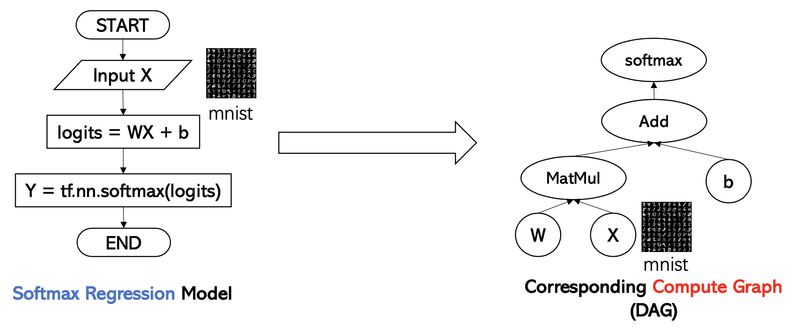
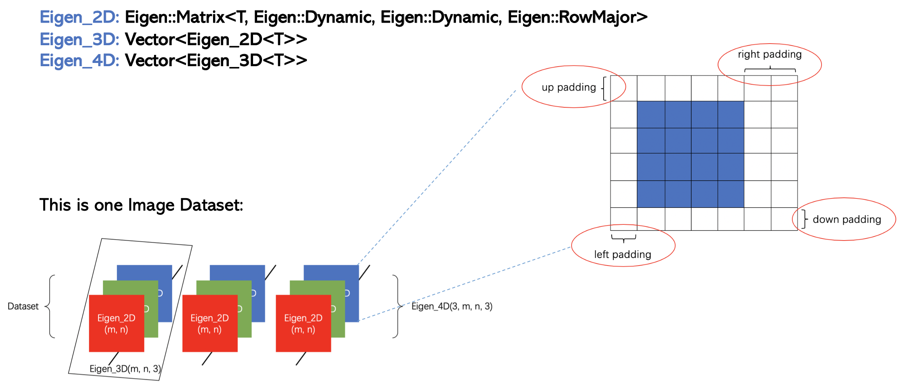

# 

This is an inference tool for TensorFlow model. 

> * Test Deep Learning Models are from [TensorFlow Tutorial](https://github.com/GoogleCloudPlatform/tensorflow-without-a-phd/tree/master/tensorflow-mnist-tutorial).
> * Extract Compute Graph from CKPT model using **Multi-way Tree** and **Topology Algorithm**.
> * Save the model in JSON file using [JsonCPP](https://github.com/open-source-parsers/jsoncpp).
> * Use [Eigen](http://eigen.tuxfamily.org/index.php?title=Main_Page) to define operation like **Convolution**, **Activator**, **Argmax**, **Addbroadcast**, **Matmul** and etc.

### 1. Introduction
 

Generally speaking, to build a Deep Learning Model, we would use framework like **TensorFlow** to construct net structure based on the FlowChart to the left. The compute graph on the right side is what we can extact from CKPT model. The Tensor Value is in Meta Graph and attributes of Tensor Node are in **tf.Session().graph_def**.

The compute graph is a DAG, so we can use **Multi-way Tree[^Tree]** to store the graph. **Topology Algorithm** is used to restore the compute path.

### 2. Compile and Run the Project

This project is compiled on both **macOS** and **Linux16.04**. You can install the project in **CLion** or directly run the project in Linux Shell.

Please ensure that the following library is correct installed before implement this project:

* GCC 5.4.0
* JsonCPP 
* Eigen 3.3.7

**Note:** The newest version of JsonCPP should compiled with CMAKE. Be sure to set the right path of libs and library in CMAKELists and Makefile.

### 3. Define the operation

 **Eigen** can only do calculation on 2D matrix. So I write wrapper on the Eigen Matrix to genralize datatype to 3D and 4D. The value is stored in row major. 

 - Eigen_3D\<T> m(a, b, c);
   * a: Number of channels
   * b: X axis of image
   * c: Y axis of image
 - Eigen_4D\<T> m(a, b, c, d, kernel);
   * d: Number of filters
   * a: X axis of image
   * b: Y axis of image
   * c: Number of channels
 - Eigen_4D\<T> m(a, b, c, d, image);
   * a: Number of images
   * b: X axis of image
   * c: Y axis of image
   * d: Number of channels
 
 The most complicated operation is **tf.conv2d**. We need to deal with the case with **padding_type::same** and **strides**.

<i class="icon-question"></i> **Q1:** What is the dimension of convd result? 
<i class="icon-pencil"></i> dimension = ((input – filter) / stride) + 1

<i class="icon-question"></i> **Q2:** How to deal with the case when padding is padding_type::same? 
<i class="icon-pencil"></i> needed_padding = (((input/stride))-1) * (stride) + filter - input 
<i class="icon-pencil"></i> left_padding = needed_padding /2 
<i class="icon-pencil"></i> right_padding = needed_ padding - left_padding 

### 4. Test on Mnist Dataset[^data]

| Deep Learning Model | data   |  My Inference  | TensorFlow Inference|
| --------   | -----:  | ----:  | :----: |
| Convolution_Model.json    | data15.json |  [0 6 2 3 1 8 5 4 6 4 7 5 9 3 1 7 0 7 9 2 0 5 2 7 8 9 5 3 0 9 7 8 ] | [0 6 2 3 1 8 5 4 6 4 7 5 9 3 1 7 0 7 9 2 0 5 2 7 8 9 5 3 0 9 7 8] |
| Fully_Connect_Model.json  |   data2.json  |   [6 9 4 8 4 6 4 0 0 1 9 6 5 1 3 2 4 4 2 0 3 9 4 6 8 5 3 2 7 6 1 1 ] | [6 9 4 8 4 6 4 0 0 1 9 6 5 1 3 2 4 4 2 0 3 9 4 6 8 5 3 2 7 6 1 1 ] |
| Softmax_Regression_Model.json  |  data.json  |  [1 7 2 7 8 1 3 7 4 6 0 9 1 8 3 1 1 7 8 3 8 3 6 0 2 3 0 1 0 2 0 9] | [1 7 2 7 9 1 3 7 4 6 0 9 1 8 3 1 1 7 8 3 8 3 6 0 2 3 0 1 0 2 0 9]|

------

I am still working on the generalization of this tool. Add more abstarctions and generalized the tool to RNN model......  

Author [@Bean][1]     
2019-12-31    

[^data]: http://yann.lecun.com/exdb/mnist/
[^Tree]: http://faculty.cs.niu.edu/~freedman/340/340notes/340multi.htm

[1]: https://weibo.com/p/1005055506840286/home?from=page_100505&mod=TAB&is_all=1#place

